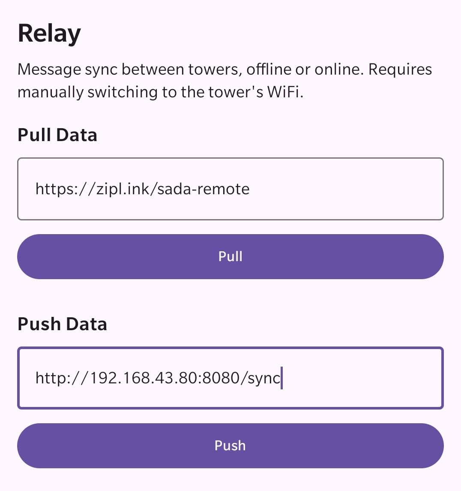

# sada-poc
Sada is a local network system of phones that can be plugged into the internet.

Disclaimer: It is a proof of concept.

## Impact

During war, the first thing to go is infrastructure.

Today, we rely a lot on our networks. We check-up on each other, we work from home, we study online, and so much more...

This is an attempt to bring back networks to where they're needed the most, especially in Gaza and Ukraine.

It creates a network if one isn't available, and expands the reach of the ones that are.

As a start, hopefully with this system, people will not need to walk to the Egyptian border to check-up on their loved ones.

Maybe, eventually, we can help get education to those who need it as well.

## Audience

People who are in areas with no internet.

For example, Gazans walk to the Egyptian border to get cell service ([readmore](https://www.reuters.com/world/middle-east/desperate-news-gazans-struggle-with-mobile-network-2024-02-02/)).

## Quick start

You need at least 2 devices (1 Sada Tower, and 1 Sada SMS). Check "Components" for a guide on how to use each.

Check the [releases](https://github.com/nizarmah/sada-poc/releases) for the latest version.

## Components

### Sada Tower

A server for network data and applications.

#### Description

This is a simple HTTP server with:
1. API endpoints to interact with the network.
1. Database to store network data.

#### Guide

1. Rename your hotspot to `SADA-XYZ`.
1. Remove password protection from the hotspot.
1. Disable the "Turn off hotspot automatically" option, if applicable.
1. Turn on the hotspot.
1. Open the Sada Tower app.
1. Keep the app open aslong as you want the tower to be online.

#### Preview

### Sada SMS

A short-messaging-service to broadcast messages across the network.

#### Description

This is simply an HTTP client that uses the Sada Tower's messaging API.

#### Guide

1. Connect to a nearby Sada Tower using WiFi, eg. `SADA-A`.
1. Open the Sada SMS app.
1. Ensure tower status is ✅.
1. Set your username.
1. Send a message to the network.

#### Preview

### Sada Relay

A synchronization service to share info across the network.

#### Description

This is also a simple HTTP client that uses the Sada Tower's syncing API.

The relay hops between two WiFi connections, carrying the data from one tower to the other.

Right now, you're doing the hopping EB, but it will be automated in a real system.

#### Guide

##### Offline synchronization

1. Place the phone near 2 Sada Towers.
1. Connect to the first tower using WiFi, eg. `SADA-A`.
1. Get the tower's gateway IP address, eg. `192.168.43.80`.
1. Open the Sada Relay app.
1. Pull from the tower sync URL, eg. `http://192.168.43.80:8080/sync`.
1. Connect to the second tower using WiFi, eg. `SADA-B`.
1. Fetch the Gateway IP of the tower, eg. `192.168.43.100`.
1. Push to the tower sync URL, eg. `http://192.168.43.100:8080/sync`.
1. Pull to from the tower sync URL, eg. `http://192.168.43.100:8080/sync`.
1. Connect back to the first tower using WiFi, eg. `SADA-A`.
1. Push to the tower sync URL, eg. `http://192.168.43.80:8080/sync`.

##### Online synchronization

1. Place the phone near a WiFi with internet access and a Sada Tower.
1. Connect to WiFi with internet access, eg. `Free WiFi`.
1. Open the Sada Relay app.
1. Pull from a remote server, eg. `https://zipl.ink/sada-remote`.
1. Connect to the Sada Tower using WiFi, eg. `SADA-A`.
1. Push to the tower sync URL, eg. `http://192.168.43.80:8080/sync`.
1. You can also pull from the tower and push to the remote server, but you need a server unlike my JSON gist file 😅

#### Preview

## Future work

- [ ] tower,relay,sms: Harden the network system.
- [ ] tower: Auto-create local only hotspots.
- [ ] relay: Auto-hop between towers.
- [ ] tower: Install app from tower, as long as 1 device has it.
- [ ] relay: Create reliable internet for feedback from users.
- [ ] sms: Add groups for orgs to broadcast to users.
- [ ] sms: Add direct messaging.
- [ ] tbd

## Contributing

Just open an issue or PR. The more hands on deck, the faster we can get this out to those who need it.
